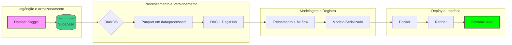

# Projeto Final - Previsão de Aprovação de Empréstimo

## Problema (Justificativa)
Bancos e instituições financeiras recebem diariamente diversas solicitações de empréstimo. Avaliar manualmente cada pedido é caro e demorado.
O objetivo deste projeto é construir um modelo de classificação binária que, dado o perfil do solicitante, preveja se o empréstimo será aprovado ou recusado, auxiliando o processo de triagem.

**Tipo de problema:** Classificação binária supervisionada
**Variável‑alvo:** loan_status (1 = Aprovado, 0 = Recusado)
**Métricas:** Accuracy, F1-Score, ROC AUC  
**Objetivo de negócio:** priorizar análises para clientes mais propensos a aprovação, reduzindo tempo e custo operacional.

## Dataset
- **Fonte:** Kaggle — Loan Prediction Problem Dataset
- **Link:** https://www.kaggle.com/datasets/altruistdelhite04/loan-prediction-problem-dataset
- **Tamanho:** ~614 registros, 13 colunas

## Stack
Supabase → DuckDB → DVC/DagsHub → MLflow → Docker → Render → Streamlit




### 📁 Estrutura do Projeto

```text
projeto-final/
├── data/               # Dados versionados via DVC
│   ├── raw/
│   └── processed/
├── notebooks/          # EDA exploratória
├── src/
│   ├── ingestion.py    # Ingestão Supabase -> Parquet
│   ├── preprocessing.py # Feature engineering com DuckDB
│   ├── train.py        # Treinamento + MLflow
│   └── predict.py      # Função de inferência
├── app/
│   └── streamlit_app.py # Interface Streamlit
├── models/             # Modelo final (.pkl)
├── Dockerfile
├── requirements.txt
├── dvc.yaml
├── .env                # Credenciais (não versionado)
├── .gitignore
└── README.md
